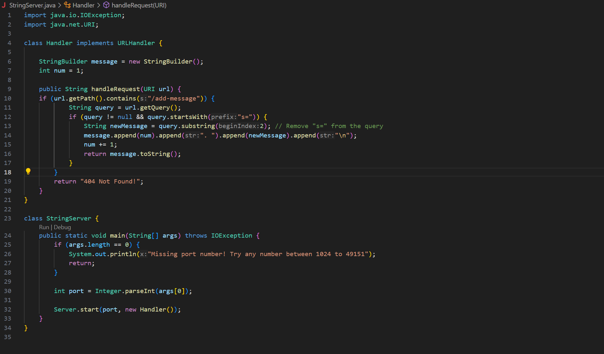
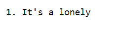
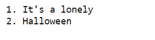
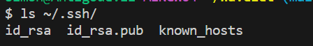
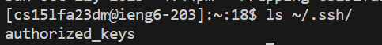
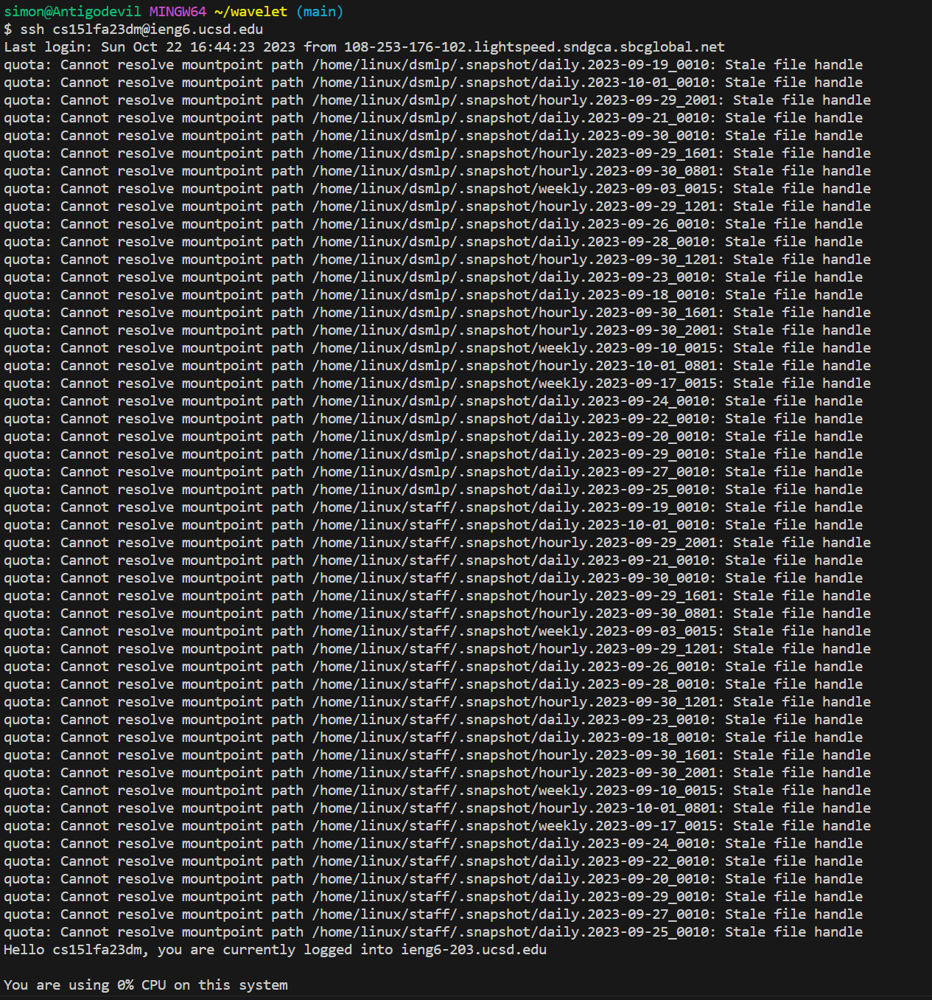

# Lab Report 2

## Part 1:

When a user accesses the server through /add-message, the handleRequest method is called.
The relevant argument url contains the URI with the path /add-message and the query s=It's a lonely.
The initial value for num, the index number for each request, is 1. It is changed to 2 after the message is printed.

The handleRequest method is called once again similar to screenshot1.
The relevant argument url contains the URI with the path /add-message and the query s=Halloween.
Num is changed from 2 to 3 after the message is printed to handle the next request.

## Part 2:

## Part 3:

In weeks 2 and 3, I learned how to establish a connection to a remote server using SSH, which allows for secure file transfers and remote command execution. I learned how to create a basic search engine, and I also learned how to initiate my own server and handle simple requests. One extra thing I learned which I find very helpful is the different methods of adding images in a mark down cell, which actually deepens my understanding to relative and absolute paths.

