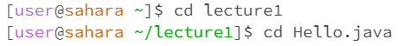
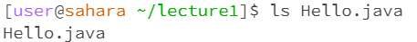

# Lab Report 1

## cd:

The working directory is /home. Using cd without any arguments will not cause a change in directory. This is not an error; it does not have a valid argument so it will remain in its current directory.

The working directory is /home/lecture1. Using cd with a path to a directory will allow us to change directory and access the files inside. If we don't change directory, we are unable to access the files inside the lecture1 directory such as Hello.class or Hello.java. This is not an error.

The working directory is /home. Using cd with a path to a file will cause an error. A file is not a directory, so the cd command won't produce any useful results. This is an error.

## ls

The working directory is /home. Using ls without any arguments will list out all the directories and files in your current directory. In this case, it will be our default directory, so the ls command will only display the lecture1 directory. This is not an error.

The working directory is /home. Using ls with a path to a directory lists out all directories and files under that specific directory. In this case, it prints out all the files under the directory first, then the "messages" folder. This is not an error.

The working directory is /home/lecture1. Using ls with a path to a file will simply just list the file name. The ls command doesn't access the contents inside the file, it will only print the file name. This is not an error.

## cat

The working directory is /home. Using cat without any arguments will not cause it to concatenate anything, because there is not content inside. This is not an error.

The working directory is /home. Using cat with a path to directory will cause an error, because cat can only display the contents in a file. This is an error.

The working directory is /home/lecture1. Using cat with a path to a file will make it print out the contents inside the file, in this case, the code inside Hello.java. This is not an error.
