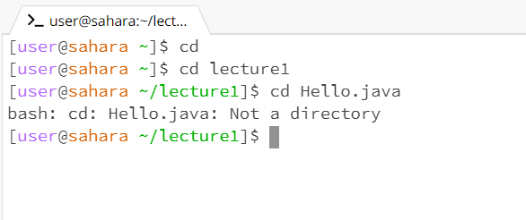
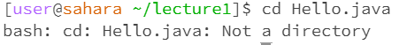
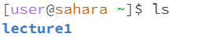
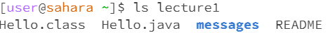
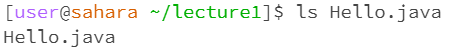

# Lab Report 1

## cd:

Using cd without any arguments will not cause a change in directory(not an error).

Using cd with a path to a directory will allow us to change directory and access the files inside(not an error).

Using cd with a path to a file will cause an error, because a file is not a directory, thus the code won't produce any results.

## ls

Using ls without any arguments will list out all the directories and files in your current directory.

Using ls with a path to a directory lists out all directories and files under the path.

Using ls with a path to a file will simply just list the file name.
